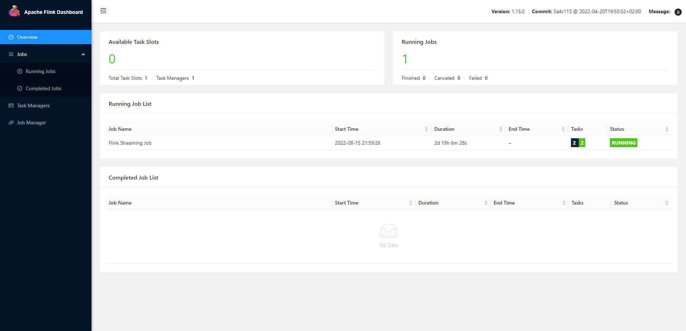

# Flink on Native Azure Kubernetes

Kubernetes is a popular container-orchestration system for automating computer application deployment, scaling, and management. Flink’s native Kubernetes integration allows you to directly deploy Flink on a running Kubernetes cluster. Moreover, Flink is able to dynamically allocate and de-allocate TaskManagers depending on the required resources because it can directly talk to Kubernetes.

This tutorial will show how to deploy Apache Flink natively on Azure Kubernetes.

## Examples

Outline the examples in the repository.

| Example | Description | Pipeline Status |
|-|-|-|
| [Flink streaming examples](flink-streaming-example) |  Examples for Flink Streaming, including custom source & sink |  |
| [Flink batch examples](flink-batch-example) |  Examples for Flink Batch, including custom sink (source is developing and update soon) |  |
| [Flink CDC SQL Server examples](flink-cdc-sql-server-example) |  Examples for Flink Batch, including custom sink (source is developing and update soon) |  |

## Prerequisites

Basic:

* [Git](https://www.git-scm.com/downloads)
* [Java Development Kit (JDK) 1.8](https://www.oracle.com/java/technologies/javase/javase8u211-later-archive-downloads.html)
* [Apache Maven](http://maven.apache.org/download.cgi) and [install](http://maven.apache.org/install.html) a Maven binary archive
* [Azure CLI](https://docs.microsoft.com/en-us/cli/azure/install-azure-cli)

Azure:

* [Azure Container Registry](https://azure.microsoft.com/en-us/services/container-registry/)
* [Azure Kubernetes](https://azure.microsoft.com/en-us/services/kubernetes-service/)

Flink:

* [Flink](https://downloads.apache.org/flink)


## Create and Publish the Docker image to Azure Container Registry

The Flink community provides a base Docker image which can be used to bundle the user code:

```
ARG java_version=java8
ARG scala_version=scala_2.12
ARG flink_version=1.15.0
FROM flink:$flink_version-$scala_version-$java_version

ARG artifact_id=flink-example
ARG version=1.0-SNAPSHOT

RUN mkdir -p $FLINK_HOME/usrlib
COPY target/$artifact_id-$version.jar $FLINK_HOME/usrlib/$artifact_id-$version.jar
```

And you can build image and publish it into Azure Container Registry

```
az acr login --name $(registry)

docker build --no-cache -t $(registry).azurecr.io/$(artifact_id):$(version) .
docker push $(registry).azurecr.io/$(artifact_id):$(version)
```

## Deploy Flink Job on Azure Kubernetes

get kubeconfig use Azure CLI:

```
az aks get-credentials --resource-group $RESOURCE_GROUP --name $CLUSTER
```

create role & rolebinding to your default service account

```

kubectl create role flink-role --verb=get --verb=list --verb=watch --verb=create --verb=update --verb=patch --verb=delete  --resource=pods,services,deployments,namespaces --namespace=$(namespace)

kubectl create rolebinding flink-rolebinding --role=flink-role --serviceaccount=$(namespace):default --namespace=$(namespace)

```

create secret for accessing Azure Container Registry:

```
kubectl create secret docker-registry $(registry)-secret \
    --docker-server=$(registry).azurecr.io \
    --docker-username=$(registry_password) \
    --docker-password=$(registry_password) \
    --namespace=$(namespace)
```

deploy Flink job with native k8s application mode through Flink CLI:

```
tar -zxvf flink-1.15.0-bin-scala_2.12.tgz
cd flink-1.15.0/
/bin/flink run-application \
  --target kubernetes-application \
  -Dkubernetes.namespace=$(namespace) \
  -Dkubernetes.cluster-id=$(artifact_id) \
  -Dkubernetes.container.image=$(registry).azurecr.io/$(artifact_id) \
  -Dkubernetes.container.image.pull-secrets=$(registry)-secret \
  -Dkubernetes.container.image.pull-policy=Always \
  local:///opt/flink/usrlib/$artifact_id-$version.jar
```

You could access Flink Web UI through

```
kubectl port-forward svc/$artifact_id-rest 8081 -n flink
```

and access http://localhost:8081



## Contributing

This project welcomes contributions and suggestions.  Most contributions require you to agree to a
Contributor License Agreement (CLA) declaring that you have the right to, and actually do, grant us
the rights to use your contribution. For details, visit https://cla.opensource.microsoft.com.

When you submit a pull request, a CLA bot will automatically determine whether you need to provide
a CLA and decorate the PR appropriately (e.g., status check, comment). Simply follow the instructions
provided by the bot. You will only need to do this once across all repos using our CLA.

This project has adopted the [Microsoft Open Source Code of Conduct](https://opensource.microsoft.com/codeofconduct/).
For more information see the [Code of Conduct FAQ](https://opensource.microsoft.com/codeofconduct/faq/) or
contact [opencode@microsoft.com](mailto:opencode@microsoft.com) with any additional questions or comments.

## Trademarks

This project may contain trademarks or logos for projects, products, or services. Authorized use of Microsoft
trademarks or logos is subject to and must follow
[Microsoft's Trademark & Brand Guidelines](https://www.microsoft.com/en-us/legal/intellectualproperty/trademarks/usage/general).
Use of Microsoft trademarks or logos in modified versions of this project must not cause confusion or imply Microsoft sponsorship.
Any use of third-party trademarks or logos are subject to those third-party's policies.
