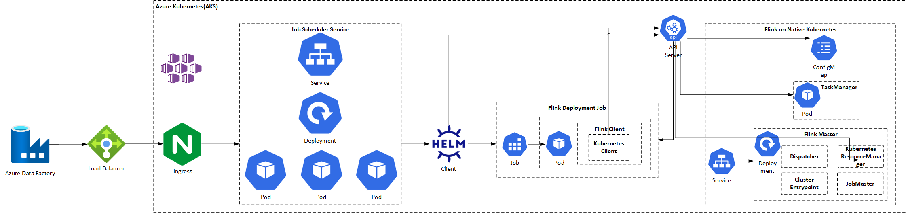

# Azure Data Factory Cloud Native Extension

## Prerequisites

* [Go 1.18](https://go.dev/dl/)
* [Client-Go](https://pkg.go.dev/k8s.io/client-go/kubernetes)
* [Helm](https://helm.sh/)
* [Azure Kubelogin](https://github.com/Azure/kubelogin)
* [Azure RBAC](https://docs.microsoft.com/en-us/azure/aks/manage-azure-rbac)
* [Kubernetes RBAC](https://kubernetes.io/docs/reference/access-authn-authz/rbac/)
* [Flink](https://downloads.apache.org/flink)

## Architecture

