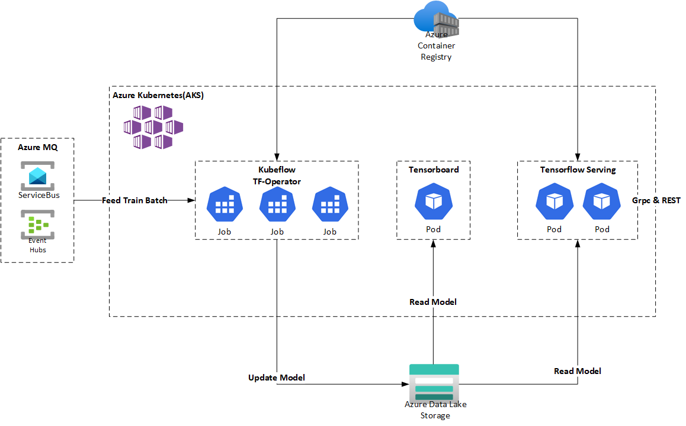

# Flink Online & Offline Distributed Training - Tensorflow Integration

## Prerequisites

* [Flink](https://downloads.apache.org/flink)
* [Tensorflow](https://www.tensorflow.org/)
* [Kubeflow](https://www.kubeflow.org/)
* [Azure Blob Storage NFS Support](https://learn.microsoft.com/en-us/azure/storage/blobs/network-file-system-protocol-support)

## Architecture

